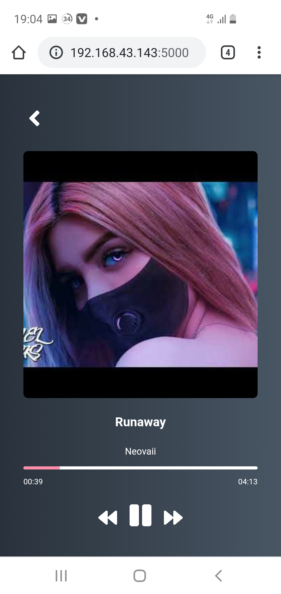
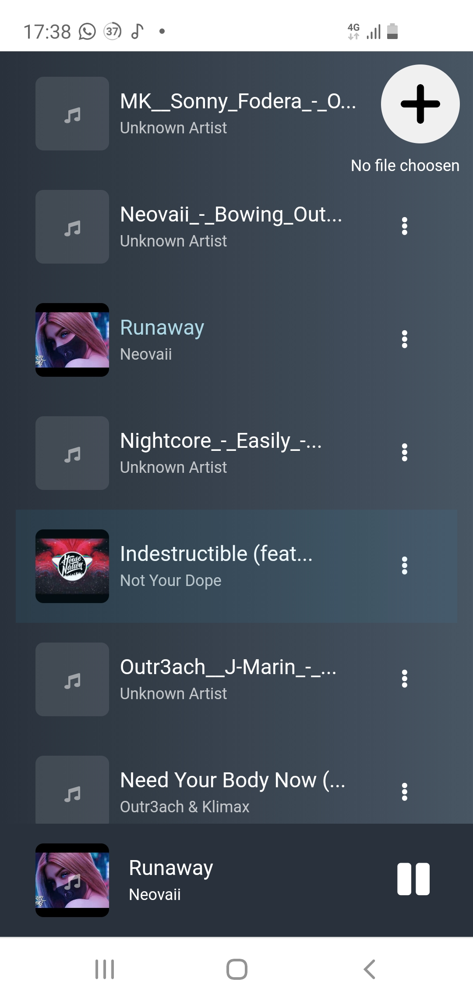
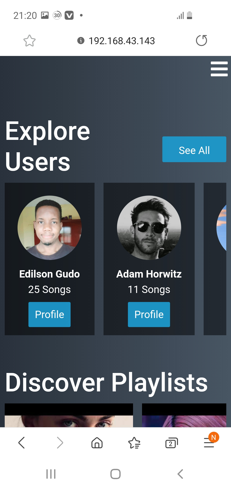
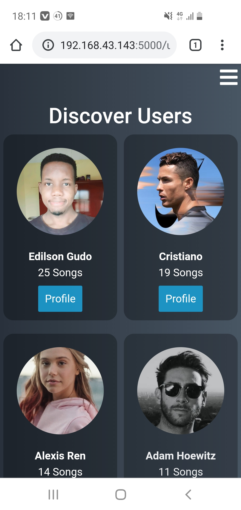

# Django Music Streaming platform
A Django web aplication for sharing and streaming music
The app can be accessed by any device if connected to the same network

### Screenshots










### Installation and Usage

```
pip install -r requirements.txt

```

```
python manage.py runserver

```
